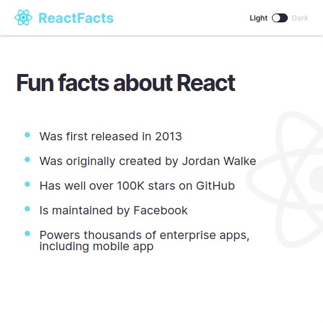
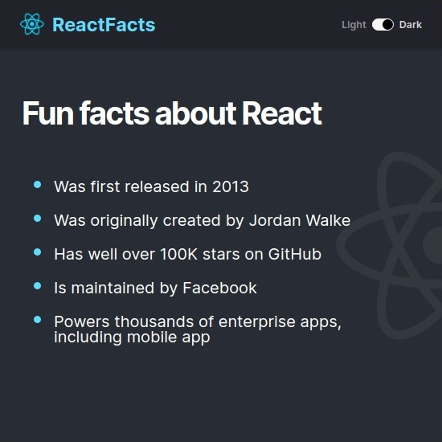

# React Facts Site
Your very first React app will be a static site about React! This gives you an intro to the basic principles of the library.

## Table of contents
- [Introduction](#introduction)
- [Overview](#overview)
  - [Screenshot](#screenshot)
  - [Built using](#built-using)
  - [Lessons Learned](#lessons-learned)
- [Author](#author)
- [Acknowledgement](#acknowledgement)
- [Additional Note](#additional-note)

## Introduction
- This is my solution to the first part of [Learn React](https://scrimba.com/learn/learnreact).
- This webpage was setup using [Vite](https://vitejs.dev/).
- This webpage features:
    - Basic React components
    - Dark Mode

## Overview
- Link: [github.com/kierhb/react-facts-site](https://github.com/kierhb/react-facts-site)

### Screenshot

### Built using

- HTML5 markup
- CSS
- Vanilla JavaScript
- ReactJS

### Lessons Learned

- Why we use React
- JSX
- Custom components
- Styling
- Static Pages

## Author

- GitHub - [@kierhb](https://github.com/kierhb)
- LinkedIn - [Kier Bobila](https://www.linkedin.com/in/kier-bobila/)

## Acknowledgement
I want to acknowledge the course instructor Bob Ziroll and to all members of Scrimba community.

## Additional Note
The added toggle feature for dark mode was covered in the fourth part of the [Learn React](https://scrimba.com/learn/learnreact).